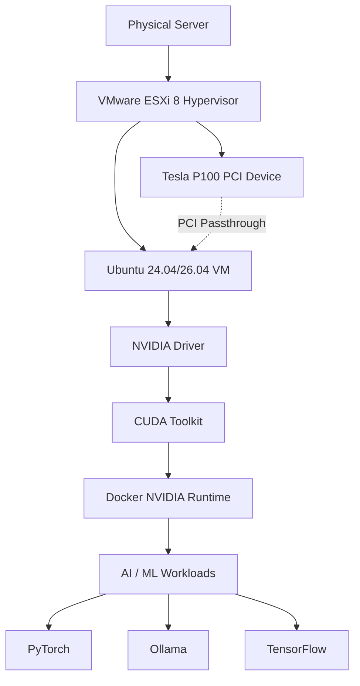
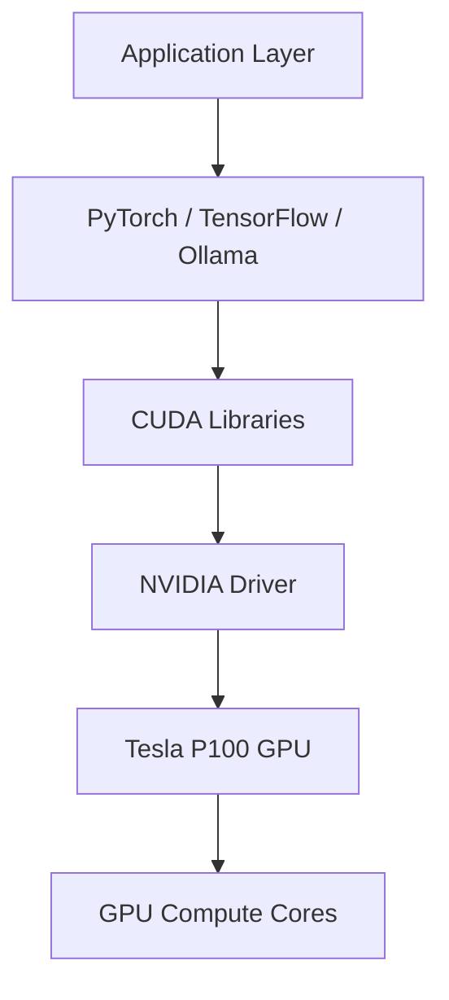
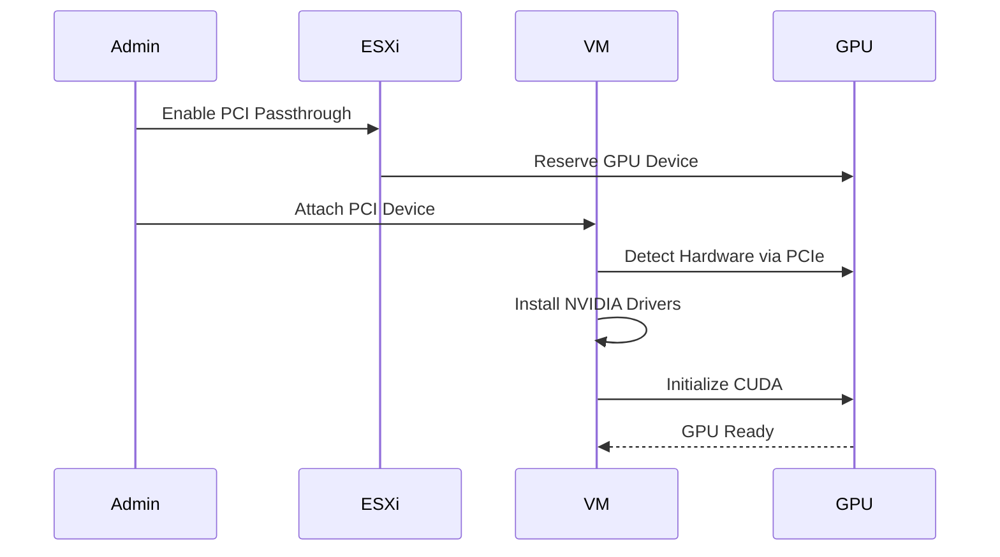
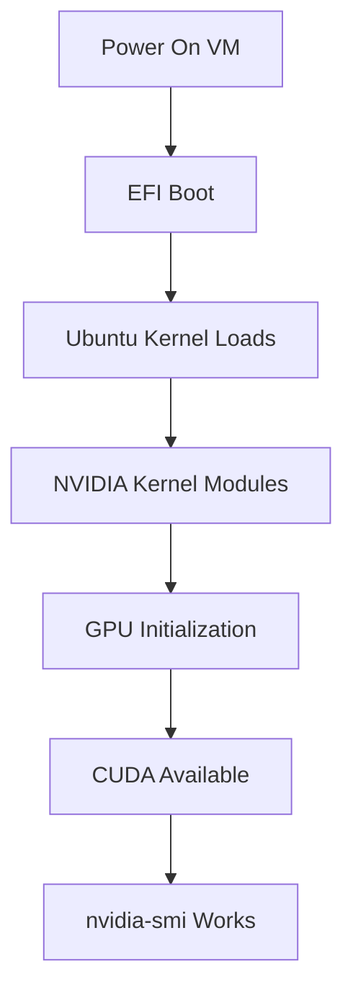
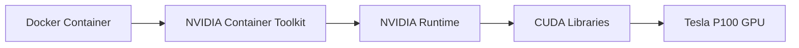
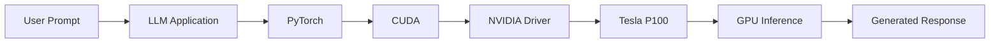
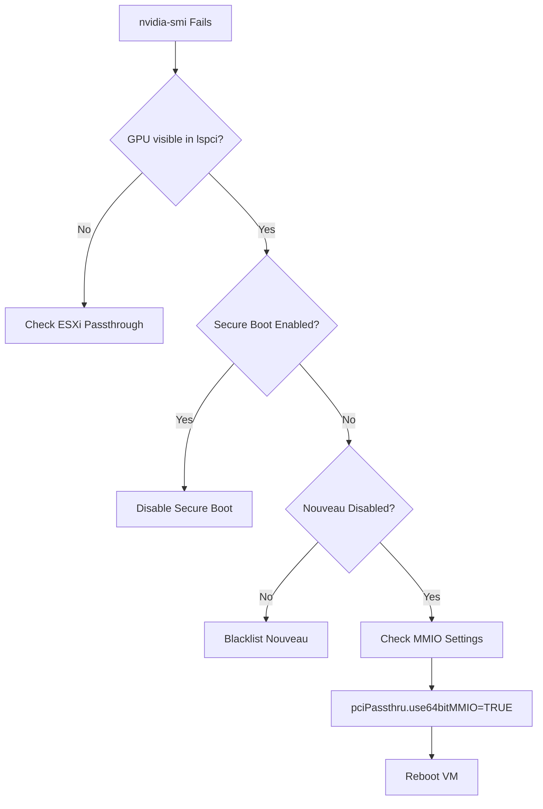

# Nvidia Tesla P100 GPU Card on Ubuntu 24.04/26.04 with ESXi 8 Passthrough

This repository documents the complete process of getting an NVIDIA Tesla P100 GPU working inside an Ubuntu VM running on VMware ESXi 8 using PCI passthrough.

The guide includes:

- ESXi passthrough configuration
- VM advanced configuration parameters
- Ubuntu installation
- NVIDIA driver installation
- CUDA installation
- Docker + NVIDIA runtime setup
- Troubleshooting common issues
- Validation/testing procedures

---

# High-Level Architecture



---

# Hardware Used

| Component | Details |
|---|---|
| Hypervisor | VMware ESXi 8 |
| GPU | NVIDIA Tesla P100 PCIe 16GB |
| Guest OS | Ubuntu Server 24.04 / 26.04 |
| VM Firmware | EFI |
| CUDA | 12.x |
| Driver Branch | 535/550/570 |

---

# NVIDIA Software Stack



---

# Important ESXi VM Settings

These VMX parameters are critical for large BAR Tesla cards like the P100:

```ini
pciPassthru.use64bitMMIO = "TRUE"
pciPassthru.64bitMMIOSizeGB = "64"
hypervisor.cpuid.v0 = "FALSE"
```

Recommended additional settings:

- Reserve all guest memory
- Disable Secure Boot
- EFI firmware only
- Add BOTH:
  - GPU PCI device
  - GPU Audio PCI device

---

# ESXi GPU Passthrough Process



---

# Step-by-Step Guide

## 1. Enable Passthrough in ESXi

1. Navigate to:
   Host → Manage → Hardware → PCI Devices

2. Enable passthrough for:
   - Tesla P100 GPU
   - Tesla P100 Audio Device

3. Reboot ESXi host

---

## 2. Configure VM

Before powering on the VM:

- Set firmware to EFI
- Reserve all guest memory
- Add PCI devices
- Add VMX advanced parameters

---

## 3. Install Ubuntu

Install Ubuntu Server 24.04 or Ubuntu 26.04.

After installation:

```bash
sudo apt update && sudo apt upgrade -y
```
---

## 4. Disable Nouveau

```bash
sudo nano /etc/modprobe.d/blacklist-nouveau.conf
```

Add:

```conf
blacklist nouveau
options nouveau modeset=0
```

Then:

```bash
sudo update-initramfs -u
sudo reboot
```

---

## 5. Verify GPU Detection

```bash
lspci | grep -i nvidia
```

Expected output should show:

```text
NVIDIA Corporation GP100GL [Tesla P100 PCIe 16GB]
```

---

## 6. Install NVIDIA Drivers

Recommended:

```bash
sudo ubuntu-drivers autoinstall
```

Or install manually:

```bash
sudo apt install nvidia-driver-550 -y
```

Reboot:

```bash
sudo reboot
```

Validate:

```bash
nvidia-smi
```

---

# VM Boot + GPU Initialization



---

## 7. Install CUDA

Add NVIDIA CUDA repository:

```bash
wget https://developer.download.nvidia.com/compute/cuda/repos/ubuntu2404/x86_64/cuda-keyring_1.1-1_all.deb

sudo dpkg -i cuda-keyring_1.1-1_all.deb

sudo apt update

sudo apt install cuda -y
```

Verify:

```bash
nvcc --version
```

---

# Docker + GPU Runtime Flow



---

## 8. Docker NVIDIA Runtime

Install NVIDIA container toolkit:

```bash
sudo apt install nvidia-container-toolkit -y
```

Configure runtime:

```bash
sudo nvidia-ctk runtime configure --runtime=docker
```

Restart Docker:

```bash
sudo systemctl restart docker
```

Test:

```bash
docker run --rm --gpus all nvidia/cuda:12.4.1-base-ubuntu24.04 nvidia-smi
```

---

# Full AI Inference Pipeline



---

# Common Problems

## `nvidia-smi` fails

Usually caused by:

- Nouveau not disabled
- Secure Boot enabled
- Missing MMIO configuration
- Missing memory reservation
- Wrong driver version
- GPU audio device not passed through

---

# Troubleshooting Decision Tree



---

## VM Boot Hang

Try:

```ini
pciPassthru.disableFLR = "TRUE"
```

Also ensure:

- EFI firmware enabled
- Full memory reservation enabled

---

## GPU Visible in `lspci` but Drivers Fail

Usually fixed by:

- `hypervisor.cpuid.v0 = "FALSE"`
- Disabling Secure Boot
- Using 64-bit MMIO

---

# Validation

## GPU Status

```bash
dkms status
nvidia-smi
nvidia-smi topo -m
```

## CUDA Test

```bash
deviceQuery
```

## PyTorch Test

```python
import torch
print(torch.cuda.is_available())
```

---

# Useful Commands

## Check GPU

```bash
lspci | grep -i nvidia
```

## Check Driver

```bash
nvidia-smi
```

## Check CUDA

```bash
nvcc --version
```

## Check Kernel Modules

```bash
lsmod | grep nvidia
```
## Check Usage by LLM model
```bash
ai-server:~$ ollama ps
NAME                    ID              SIZE     PROCESSOR          CONTEXT    UNTIL
glm-4.7-flash:latest    d1a8a26252f1    19 GB    17%/83% CPU/GPU    4096       4 minutes from now
ai-server:
```
---

# References

## NVIDIA Documentation

- https://docs.nvidia.com/
- https://developer.nvidia.com/cuda-downloads

## ESXi + GPU Passthrough Resources

- https://forums.developer.nvidia.com/t/dell-r730-and-tesla-p100-cuda-and-driver-install-information/50781
- https://serverfault.com/questions/958239/pci-at-nvida-tesla-p-100-in-shared-pass-through-mode-is-disabled
- https://ubuntu.com/server/docs/how-to/graphics/gpu-virtualization-with-qemu-kvm/
- https://www.dell.com/support/kbdoc/en-ie/000106925/how-to-configure-a-gpu-using-discrete-device-assignment-dda-on-ubuntu-guest-operating-system

## Community References

- https://www.reddit.com/r/homelab/comments/1rb47ab/nvidia_tesla_p40_drivers_on_ubuntu_server_2404/
- https://www.reddit.com/r/esxi/comments/1knrpy7/
- https://www.reddit.com/r/PleX/comments/10jfo3m/

---

## Verify the installation
```bash
mokutil --sb-state
SecureBoot disabled
nvidia-smi

[sudo: authenticate] Password:
Thu May  7 23:24:23 2026
+-----------------------------------------------------------------------------------------+
| NVIDIA-SMI 580.142                Driver Version: 580.142        CUDA Version: 13.0     |
+-----------------------------------------+------------------------+----------------------+
| GPU  Name                 Persistence-M | Bus-Id          Disp.A | Volatile Uncorr. ECC |
| Fan  Temp   Perf          Pwr:Usage/Cap |           Memory-Usage | GPU-Util  Compute M. |
|                                         |                        |               MIG M. |
|=========================================+========================+======================|
|   0  Tesla P100-PCIE-16GB           Off |   00000000:03:00.0 Off |                    0 |
| N/A   51C    P0             29W /  250W |       0MiB /  16384MiB |      0%      Default |
|                                         |                        |                  N/A |
+-----------------------------------------+------------------------+----------------------+

+-----------------------------------------------------------------------------------------+
| Processes:                                                                              |
|  GPU   GI   CI              PID   Type   Process name                        GPU Memory |
|        ID   ID                                                               Usage      |
|=========================================================================================|
|  No running processes found                                                             |
+-----------------------------------------------------------------------------------------+
```


# Products and References
https://www.ebay.com/itm/197038986040 <br>
https://www.ebay.com/itm/286365386696 <br>
https://www.amazon.com/dp/B0CP7BNWZY <br>
https://www.amazon.com/dp/B0C8BS4MT6 <br>

